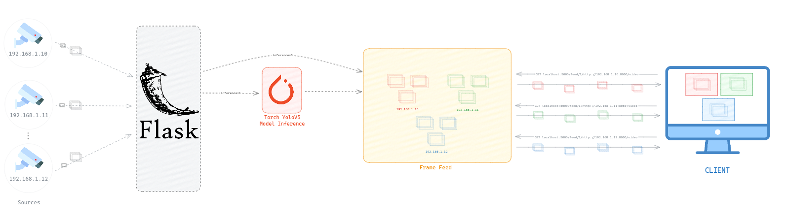

# heldet

# Diagram



# Installation

```sh
$ virtualenv venv
$ pip install -r requirements.txt
$ python feed.py
```

# Usage

- open `http://localhost:5000` on browser
- `http://localhost:5000/feed/<inference>/<imgsz>/<source_url>`
- from webcam

  - normal frame from webcam
    - http://localhost:5000/feed/0/640/0
  - inferenced frame from webcam
    - http://localhost:5000/feed/1/640/0

- from video feed
  - normal frame from video feed
    - http://localhost:5000/feed/0/640/<FEED_URL>
  - inferenced frame from video feed
    - http://localhost:5000/feed/1/640/<FEED_URL>
